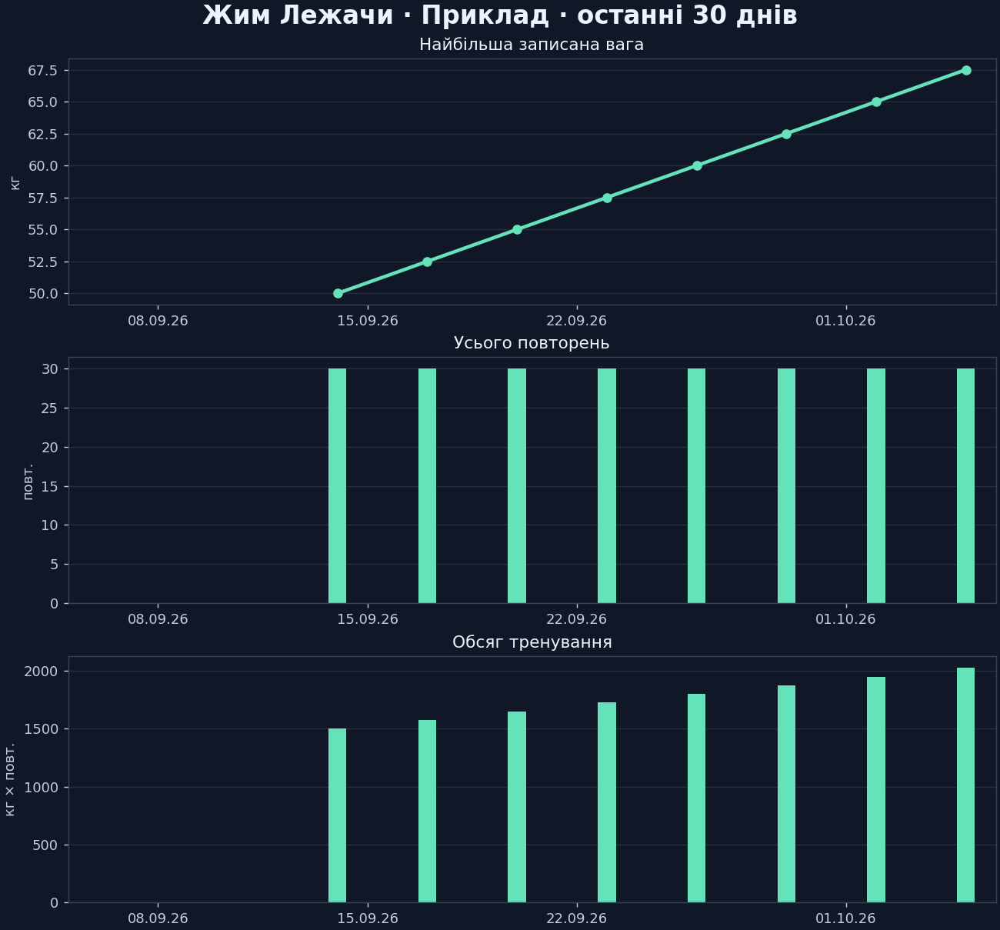

# NextSet UA

**Your private training diary in Telegram. Ukrainian bot, English setup, one-click Windows app.**

Log what you lifted, review every set, and see your progress over time. Data stays in a local SQLite database on your PC. No cloud database or paid AI subscription is required.



## Start at home — no Python required

1. Download **`NextSet-UA-Windows.zip`** from [Releases](https://github.com/ViktorRozlomii22/gym-tracker/releases/latest).
2. Right-click the ZIP → **Extract All**. Keep the extracted folder somewhere writable, such as Documents.
3. Double-click **`NextSet.exe`**.
4. On the first run, paste your Telegram bot token. Get one from [@BotFather](https://t.me/BotFather) using `/newbot`, or reuse your existing bot's token. The input is hidden.
5. Open the pairing link printed in the window and press **Start** in Telegram.

That's it. Leave the window open while using the bot. Next time, just double-click **`NextSet.exe`** again. To stop, press **Ctrl+C** or run **`STOP.cmd`**.

**Windows 10/11, x64, internet access.** No administrator access or port forwarding is required. Your PC must remain awake. Run a given bot token on only one computer at a time. The executable is unsigned; use a build from this repository or build it yourself.

## Adaptive plans for experienced lifters

Choose among five program orientations for three training days with `/programs`. Enter your profile and recent PRs, request a stable 4–6 week `/block`, check in before training, then request `/plan` and record actual sets and exercise feedback. Illness, missed sessions, equipment substitutions and an optional light fourth day are supported. Qwen generates individual proposals from a local research library and your history; source links, numeric checks and explicit approval accompany each plan. This is RAG, not model fine-tuning. Coaching remains experimental. See the [training tools guide](docs/TRAINING_GUIDE.md) and [adaptation rules](docs/PROGRAMS.md).

## What you can do

| Feature | Example |
| --- | --- |
| Quick workout entry | `Жим лежачи 3x10 60 кг` |
| Different sets and weights | Choose an exercise in the menu, enter one `weight reps` pair per line |
| Full workout diary | `/history`, `/history 2` |
| One exercise's history | `/exercise Жим лежачи` |
| Progress charts | `/graph 7`, `/graph 30`, `/graph 90`, `/graph 365` |
| Exercise chart | `/graph 90 Жим лежачи` |
| Body measurements | `/measure біцепс лівий 35,5 см; талія 82 см; вага 80 кг` |
| Measurement chart | `/graph 365 біцепс лівий` |
| Correct a mistake | `/delete 12`, `/measure_delete 3` |
| Inactivity reminders | `/remind 10`; disable with `/remind 0` |
| Excel / CSV export | **📤 Експорт даних** in the menu |
| Optional local AI | `/ai сьогодні жим лежачи 3 по 10 на 60 кг`, then `/confirm` |
| Stable training block | `/block 4`, then `/blockconfirm` |
| Pre-workout check-in | `/checkin`, answer four button prompts |
| Exercise effort and pain | `/feedback Жим лежачи; 2; ні; 4` |
| Equipment substitution | `/swap Жим лежачи; лавка зайнята`, then `/swapconfirm` |
| Weekly summary and explanation | `/weekly`, `/weeklyai`, `/weeklyremind on` |
| Local backup and restore | `/backup`, `/backups`, **RESTORE.cmd** |
| Test your real local model | **EVALUATE_AI.cmd** |

`3x10` means **three sets of ten repetitions**. Quick entries save immediately; guided entries save when you press **💾 Зберегти вправу**. Finish a workout through **🏁 Завершити тренування**. Saved exercises are visible in history even before the workout ends.

## Local AI is optional

Normal logging, history, charts, measurements and reminders work without AI.

For free-text extraction, double-click **`SETUP_AI.cmd`** once. If Ollama is missing, it opens the [official Windows download](https://ollama.com/download/windows). Install Ollama and run `SETUP_AI.cmd` again; it offers to download the model. Subsequent bot starts automatically start the local AI service. The equivalent manual model download is:

```powershell
ollama pull qwen3:4b-instruct-2507-q4_K_M
```

The model download is about 2.5 GB; runtime memory use is higher. A 16 GB PC is a reasonable starting point, but CPU speed determines latency. The bot sends text only to `127.0.0.1:11434`, uses a short context, and unloads the model after each request. There is no cloud fallback. The model does **not** manage the database: every proposed entry requires `/confirm`. Check its numbers before confirming. AI is not included in the app ZIP and is not required for setup.

## Your data

The app creates a **`data/`** folder beside `NextSet.exe`:

```text
data/
  .env                # private bot token
  nextset.sqlite3      # workouts, measurements, pairing and settings
  backups/            # latest 14 local database snapshots, no bot token
  evaluation/         # optional synthetic real-model evaluation reports
  cache/              # generated local cache
```

The running bot creates one local database backup per day. `/backup` creates another. Stop the bot and use **RESTORE.cmd** to restore a verified snapshot; your current database is backed up first and your token is preserved. To move PCs, copy a snapshot into `data/backups/` on the new PC and restore it, then enter your token there. You can also copy the entire `data/` folder while stopped. For an upgrade, replace the program files and keep `data/`. **Never upload `data/` or your token to GitHub.** The files are local but not separately encrypted; Telegram still processes messages and uploaded charts.

## Running from source

Install Python 3.12 (x64), download/clone this repository, and double-click **`START.cmd`**. It installs dependencies into a project-local `.packages` folder and starts the same first-run setup.

For development:

```powershell
python -m venv .venv
.venv\Scripts\Activate.ps1
python -m pip install -r requirements.lock
python launcher.py
python -m unittest discover -p "test_*.py" -v
python launcher.py --check
```

See [Build and release](docs/DEVELOPMENT.md) for creating the Windows app and [User guide](docs/USER_GUIDE.md) for details and limitations. [Troubleshooting](docs/TROUBLESHOOTING.md) covers setup, pairing and connection problems.

## License

See [LICENSE](LICENSE) for the application and included component terms.
